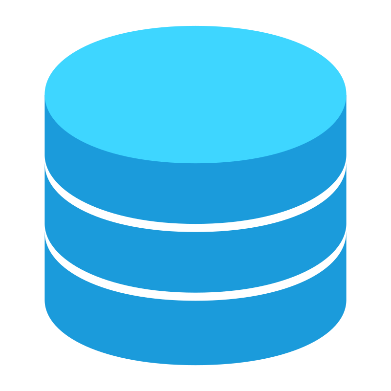

<h3 align="center">
👋 Hi there, I'm   <a href="https://www.yushi.dev/" target="_blank" rel="noreferrer">✨Jimmy Tran✨</a> 
</h3>

<h2 align="center">
I'm a Full-Stack Software Developer 💻.
</h2>

I have a strong background in software development, having worked as both a front-end and back-end developer. I am able to take ownership of a project and see it through to completion, ensuring that all deadlines are met and that the end product is of the highest quality.

## 💼 Technical Skills

###  Frontend

###  Backend

###  Database

###  Wireframe

###  Deployment

###  Collaboration

## 🤝 Connect with me

💬 Please do not hesitate to reach out to me!

- <a href="https://www.linkedin.com/in/jimmy-tran-68b312199"> LinkedIn</a>

- <a href="http://52.14.238.144/"> Homepage</a>

## 🚀 I'm currently working on

- My old projects
- Ecommerce App (Java-Spring)
- My data structure and algorithm
- My CSS skills.

## 🔭 I'm currently learning

- React/ Angular Context API
- Styled Components
